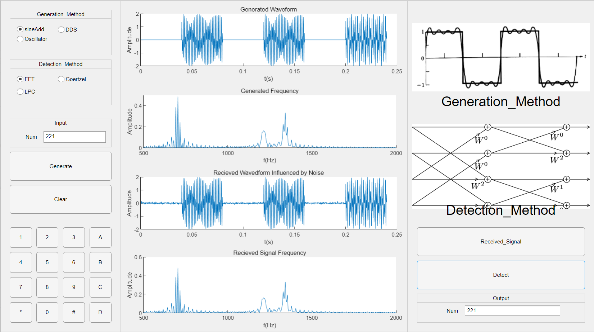
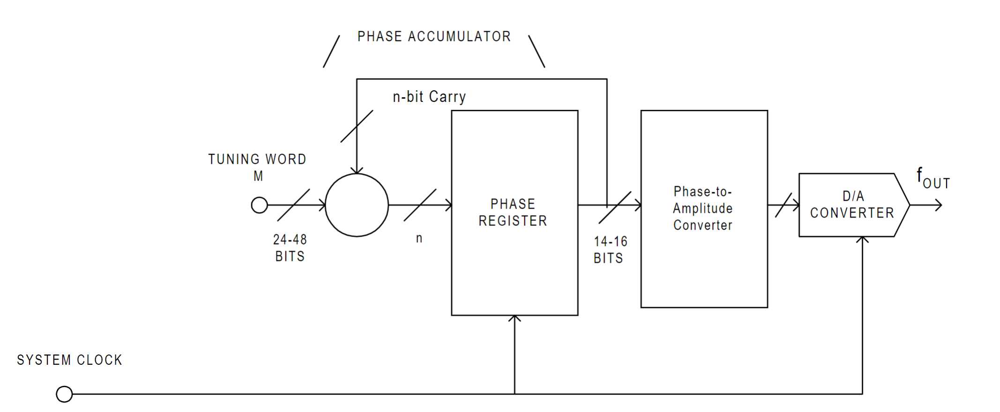

# Introduction

Starting from an abstract perspective, signals can be regarded as the statistic extracted from certain phenomenon. There are generally two ways to use these statistics. The first method would be, basing on study of physics and huge amount of experimental results, establishing differential equations and developing ways to solve them, which on some occasions are named as model-based methods. Different from them, the second type might be called as data-based. For this kind, the signals are viewed as data, and people would try to use the data to perform tasks like estimation, classification, prediction and best-filtering. 

Here in this laboratory session, the task here is to simulate a dual-tone multi-frequency (DTMF) system, containing parts including signal encoding, signal transmitting, and finally signal decoding. There are ways to fulfil the task. Here multiple methods are used, in order to show the fancy part of DSP in the content of communication. The methods used can be checked in Table. 1. 

<center>Table. 1 The algorithms applied</center>

|    Types    |    Encoding     |     Noise      | Decoding |
| :---------: | :-------------: | :------------: | :------: |
| Model-based | Cosine Addition |                |   FFT    |
|             |   Oscillator    |                | Goertzel |
| Data-based  |       DDS       | Gaussian Noise |   LPC    |

As this is a lab report, the following content would be conducted following the sequence of system description, encoding algorithm implementation, transmission simulation and decoding algorithm implementation. 

# System Overview

The DTMF communication is visualized as shown in Figure. 1.  

```
+------------------------------------------------------------------------+
|                                                                        |
|                        +--------------+                                |
|                        |              |       DTMF COMMUNICATION APP   |
|                  +-----> SIGNAL SOUND |                                |
|                  |     |              |                                |
|                  |     +--------------+                                |
|                  |                                                     |
| +------------+   |     +----------------+                +----------+  |
| |            |   |     |                |                |          |  |
| | USER INPUT +---+-----> ENCODER SWITCH +---------------->  ENCODER |  |
| |            |   |     |                |                |          |  |
| +------------+   |     +----------------+                +-----+----+  |
|                  |                                             |       |
|                  |                                             |       |
|                  |                                    +--------v-----+ |
|                  |     +----------------------+       |              | |
|                  |     |                      |       | TRANSMISSION | |
|                  +-----> SIGNAL VISULIZATION  <----+  |              | |
|                        |                      |    |  +--------+-----+ |
|                        +----------------------+    |           |       |
|                                                    |           |       |
|                                                    |           |       |
|                                                    |           |       |
|                                                    |           |       |
| +---------------+            +----------------+    |      +----v-----+ |
| |               |            |                |    |      |          | |
| | NUMBER OUTPUT <------------+ DECODER SWITCH <----+------+ RECEIVER | |
| |               |            |                |           |          | |
| +---------------+            +----------------+           +----------+ |
|                                                                        |
+------------------------------------------------------------------------+
```

<center>Figure. 1 The system skematic</center>

To give it some brief explanation, firstly the user inputs a series of phone number on the GUI interface. Once the USER INPUT module receive the number, it would ring according to the signal frequency while display the signal in the time domain. When the user click on the encode button,  the ENCODER SWITCH would start. Basing on the encoding method selected, it would encode the signal according to the method. This is done in the ENCODER module. Once the encoding is done, the .wav will be saved and the transmission process will be simulated by adding a Gaussian Noise to the signal. For the recieving part, the control logic is quite similar to the input part, which would not be discussed any further here. 

Figure. 2 is the user interface when actually acting on this application. 



<center>Figure. 2 The user interface</center>

A full version of this application can be found on link https://github.com/chancezhang1275/DTMF_MATLAB_APP. 


## Encoding Algorithms

There are three encoding methods been performed in the application. For the Cosine Addition, it is basically in the form of the equation  below. 
$$
\begin{equation}
signal = A_1\cos(2\pi \omega_1t+t_1)+A_2\cos(2\pi \omega_2t+t_2)
\end{equation}
$$
However, this method is only for mathematical representation, or can only be done with high level programming languages like MATLAB. On the actual digital machine, the cosine signal can only be generated with the help of  the direct digital synthesis(DDS) or the digital oscillator. For the rest of this paragraph, the author would firstly introduce the principles. They will be followed by  the implementation on MATLAB. 

###  DDS

Below the Figure. 3 is an overview of the DDS system from tutorial of ADI. 



<center>Figure. 3 The DDS system</center>

This system maintains a cosine phase table in the phase register. In the operation, the adder would add a fixed number each time the clock signal received. The output would be the phase stored with address being the higher (normally 8) bits of the adder. With the processing of the following modules, it would finally generate a cosine wave with configurable frequency. 

Some attempts were made by the author to implement such a system on an FPGA board. 

Here on MATLAB, the following two piece of codes are used. Note that the dds_module is the the core function, while DDS only services as an interface for other parts of this application.  

```matlab
function y = dds_module(app, fout)
	addresslen = 2^app.DDS_WORDLEN;
    address = 0:addresslen-1;
    app.DDS_ROM = floor(sin(2*pi*address/addresslen)*2^(addresslen-1)); % sine signal storage
    app.DDS_ROM = app.DDS_ROM/ max(app.DDS_ROM); % 0~1
            
    fmin = app.FREQUENCY/addresslen;
    addressgap = floor(fout/ fmin);
    addressout = (0:app.NUM_DISP-1)*addressgap;
    base_sin = mod(floor(addressout), addresslen);
            
    y = zeros(1, length(base_sin));
    y = app.DDS_ROM(base_sin+1);
end
```

```matlab
function [x, y] = DDS(app, freq1, freq2)
	y1 = app.dds_module(freq1);
	y2 = app.dds_module(freq2);

	y = y1 + y2;
	y = [0 y];
	x = [0:app.NUM_DISP]/app.FREQUENCY;
	plot(app.InWave, x, y);
end
```

For this method, the noise produced in the process is another interesting topic. It may be covered in further exploration. 


### Digital Oscillator

Unlike the DDS method which is based on data table, the digital oscillator is based on infinite impulse response(IIR) filters implemented on ASICs or FPGAs. The IIR filters' system function can be written as 
$$
\begin{equation}
H(z)=\frac{\sum_{i=0}^Mb_iz^{-i}}{1-\sum_{j=1}^Na_jz^{-j}}, 
\end{equation}
$$
or in its a series form, 
$$
\begin{equation}
H(z)=A\frac{\prod_{k=1}^{M_1}(1-c_kz^{-1})\prod_{k=1}^{M_2}(1-q_kz^{-1})(1-q^*_kz^{-1})}{\prod_{k=1}^{N_1}(1-d_kz^{-1})\prod_{k=1}^{N_2}(1-p_kz^{-1})(1-p^*_kz^{-1})}.
\end{equation}
$$
Using this equation, with more simplification, the signal flow figure of an IIR filter could be drawn and basing on that, an hard-core IP could be developed, which means that the IIR-based digital oscillator could be implemented on an ASIC or FPGA. 

However, here in MATLAB, it could be done with greater convenience. The filter function could simply the actual analysis of the IIR filter itself. 

```matlab
function [x, y] = OSC(app, freq1, freq2)
	x = zeros(1,app.NUM_DISP);
    x(1) = 1;
    y1 = filter([0 sin(2*pi*freq1/app.FREQUENCY)], [1 -2*cos(2*pi*freq1/app.FREQUENCY) 1], x);
    y2 = filter([0 sin(2*pi*freq2/app.FREQUENCY)], [1 -2*cos(2*pi*freq2/app.FREQUENCY) 1], x);
    y = y1+y2;
    x = (1:app.NUM_DISP)/app.FREQUENCY;
    plot(app.InWave, x, y);
end
```


## Transmission Simulation

Although the app is a whole in the first glance. It actually could function separately either as an encoder or as decoder. This is because once the encoding is done, the file containing the signal will be stored local. 

Note that here the ITU standard is followed. The standard requires the minimum lasting time of the DTMF signal is 40ms. As the sampling rate here is set to be 8000, the number of the  sample points here should be
$$
\begin{equation}
40ms\times8000Hz=320.
\end{equation}
$$
This is achieved by 

```matlab
function soundButton(app, y, fs)
	soundsc(y,fs);
    app.TONE=[app.TONE,zeros(1,app.NUM_ONE),y(1:app.NUM_ONE)];
end
```

That is to say, only the first NUM_ONE(320 in this case) will be saved. The gaps between two pieces of signals are also set to be 320 sample points. 

As the transmission may not be prefect, here a Gaussian noise is added to the signal. 

```matlab
function noise2Wav(app) % Gauss Noise
	tone = audioread(string(app.TONEPATH));
    tone = (tone')*2;
    tone = awgn(tone, app.SNR, 'measured');
    audiowrite(string(app.TONEPATH),(tone')/2,app.FREQUENCY);
end
```

Note that the noise signal ratio(NSR) is set to be 25 considering that such a system may be well designed and the NSR may not be that high. Anyway, it is configurable. To change it, simply replace it in the constant definition part.

```matlab
GENERATION_METHOD;  % OSC, DDS, ADD
DETECTION_METHOD;   % FFT, GOE, LPC
FREQUENCY = 8000;
NUM_DISP = 1024;    % to display the input signal
NUM_ONE = 320;      % real transmission
DDS_ROM = [];
DDS_WORDLEN = 8;    % 2^10 = 1024
TONE = [];
TONEPATH = "./tone.wav";
SNR = 25;           % in dBW, note: for LPC, below 25, it would stop working well            <<<---
TONE2DETECT = [];
ERROR_THRED_FFT = 40;   % Hz
NUM_GOE = 205;
NUM_GOE_K = [18,20,22,24,31,34,38,42];  % [ROW COL] /8000 * 205
LPC_RANK = 12;
```


## Decoding Algorithms

To decode the signal, basing on the ITU standard, the received signal was cut into pieces and processed separately. 

### FFT vs Goertzel 

The basic transformation both FFT and Goertzel are based on is DTF. It should be noticed that the Goertzel algorithm requires less sampling points in the detection of DTMF signals. 

```matlab
function num = FFT(app, y)
	Y = 2*abs(fft(y)/length(y));
    Y(1) = Y(1)/2;
    Y = Y(1:(length(y)+1)/2);
    f = [1:(length(y)+1)/2]*app.FREQUENCY/length(y);
    [~, locs] = findpeaks(Y,'SortStr','descend', 'MinPeakDistance', 0.2);
            
    freq1=min(f(locs(1)),f(locs(2)));
    freq2=max(f(locs(1)),f(locs(2)));
    num = app.freq2num(freq1, freq2);
end

function num = GOE(app, y)
	y = y(1:app.NUM_GOE);
    out_series = abs(goertzel(y,app.NUM_GOE_K+1));
    [~, max_num1] = max(out_series(1:4));
    [~, max_num2] = max(out_series(5:8));
    num = app.KEY_TABLE(max_num1, max_num2);
end
```

### Linear Prediction Coding

This algorithm is basically originated from the sound signal processing. The basic principle of it is to find a set of arguments to represent a piece of a sound signal. The model can be written mathematically as
$$
\begin{equation}
\hat s(n)=\sum^P_{k=1}a_ks(n-k). 
\end{equation}
$$
Setting the rank of LPC to be 13, here 

```matlab
function num = LPC(app, y)
	arlist = lpc(y,app.LPC_RANK);
	num = app.arlist2num(arlist);
end
```

```matlab
function num = arlist2num(app, arlist)
	distlist = zeros(1,16);
    for i = 1:16
    	distlist(i) = dist(app.LPC_TABLE(i,:), arlist');
    end
    [~, min_num] = min(distlist);
    if min_num == 11
    	num = '*';
    elseif min_num == 12
        num = '#';
    elseif min_num == 13
        num = 'A';
    elseif min_num == 14
        num = 'B';
    elseif min_num == 15
        num = 'C';
    elseif min_num == 16
        num = 'D';
    else
        num = num2str(min_num);
	end
end
```

A set of arguments $a_k$ could be determined such that 
$$
\begin{equation}
\min \{e(n)=s(n)-\hat s(n)\}.
\end{equation}
$$
Here the arguments of the $16$ possible input signals have been pre calculated. The following steps are quite similar to machine learning, a distance is calculated. The best-matched number would be the one of the minimum distance. 


# Future Analysis

As this experiment is mostly based on MATLAB, functions related to some core algorithms have been written already. The following exploration could be conducted in the following perspectives. 

- Write the signal processing functions with one's own hands;
- Use FPGA to perform those algorithms;
- Use multithread coding to speed up the encoding and decoding process. 

